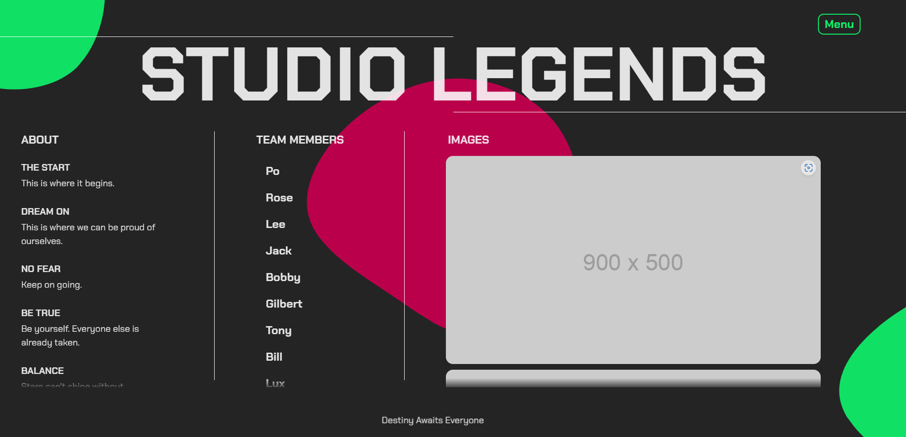

# :camping: [Vue 3 + TypeScript + Vite Website](https://vue-vite-single.netlify.app/) :camping:
**[Live Demo](https://vue-vite-single.netlify.app/)**
Created using  **Vue** + **Vite** & **TypeScript**

